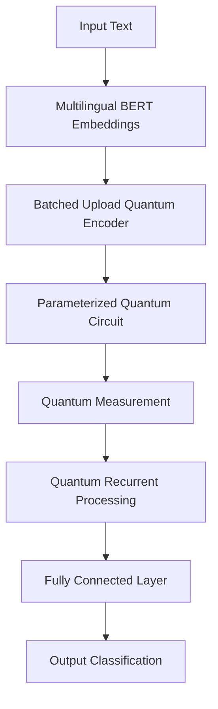
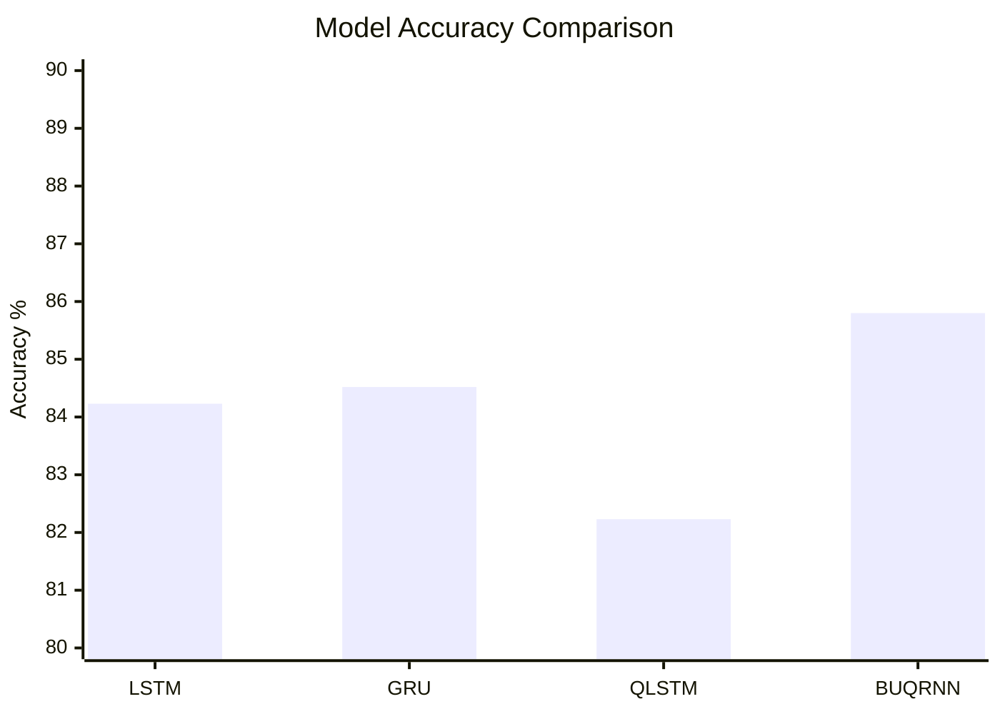

# Design and Development of Quantum Machine Learning

---

# 🚀 Overview

This project explores how Quantum Machine Learning (QML) can improve Natural Language Processing (NLP), especially for low-resource languages where training data is limited.

The proposed model, **BUQRNN (Batched Upload Quantum Recurrent Neural Network)**, combines classical AI with quantum computing concepts to create a smarter and more efficient learning system.

The framework combines:

- 🌐 Multilingual BERT for contextual text understanding
- ⚛️ Quantum Recurrent Neural Networks
- 🔄 Variational Quantum Circuits
- 📦 Batched Upload Encoding
- 🤖 Hybrid Quantum-Classical Learning

The goal is to improve:

- NLP classification accuracy
- Feature extraction
- Computational efficiency
- Low-resource language understanding

---

# 📊 System Architecture

---

# 🎯 Objectives of the Research

- Build an efficient hybrid Quantum Machine Learning architecture
- Improve multilingual NLP performance
- Reduce information loss during quantum encoding
- Improve scalability using batched upload techniques
- Explore real-world applications of Quantum AI systems

---

# 🛠️ Technologies Used

| Technology | Usage |
|---|---|
| Python | Programming Language |
| PyTorch | Deep Learning Framework |
| PennyLane | Quantum Machine Learning |
| Multilingual BERT | NLP Embeddings |
| Quantum Computing | Quantum Processing |
| NLP | Text Analysis |

---

# ⚙️ Proposed BUQRNN Architecture

The proposed system contains:

1. Input Embedding Layer  
2. Batched Upload Quantum Encoder  
3. Variational Quantum Circuit  
4. Quantum Recurrent Processing  
5. Classification Layer  

---

# ✨ Key Features

- Hybrid Quantum-Classical Framework
- Quantum Feature Extraction
- Low-Resource Language Processing
- Quantum Recurrent Neural Networks
- Efficient Batched Upload Encoding
- Scalable AI Architecture

---

# 📈 Experimental Results

## Accuracy Comparison

| Model | Accuracy |
|---|---|
| LSTM | 84.23% |
| GRU | 84.52% |
| QLSTM | 82.23% |
| BUQRNN (Proposed) | **85.80%** |

The proposed BUQRNN model outperformed several classical and quantum baseline models.

---

# 📉 Performance Graph

---

# 📚 Datasets Used

| Dataset | Accuracy |
|---|---|
| BOOK Reviews Dataset | 85.80% |
| YouTubeB-S Dataset | 93.45% |

---

# 🔬 Research Contribution

This work introduces an efficient batched upload encoding strategy that helps reduce information loss while processing high-dimensional data in quantum circuits.

The proposed model demonstrates how hybrid Quantum Machine Learning can improve NLP systems while remaining scalable and computationally efficient.

---

# 🌍 Future Scope

Future improvements may include:

- Real Quantum Hardware Deployment
- Quantum Error Correction
- Advanced Quantum Optimization
- Multilingual Expansion
- Quantum Attention Mechanisms
- Cross-Lingual NLP Systems

---

# 👨‍💻 Authors

- Kodi Satish Babu  
- Enjula Uchoi  

---

# 📄 License

MIT License
